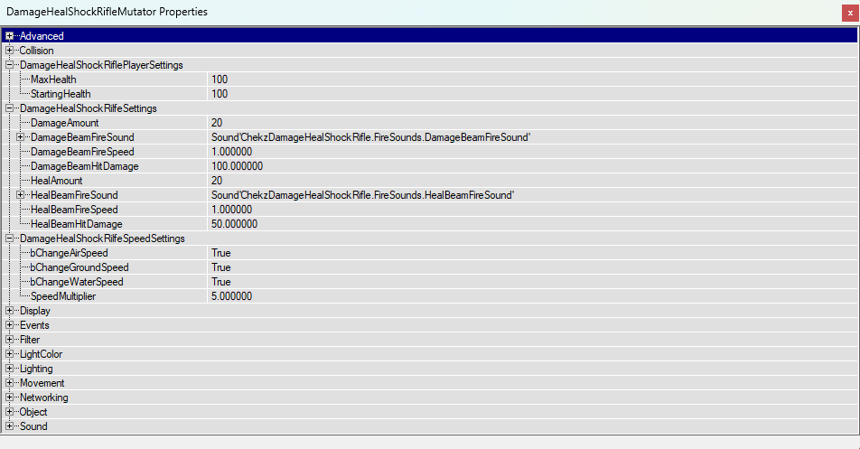

# Description
The Damage Heal Shock Rifle (DHR). Primary Fire shoots a damage beam which damages the shooter. Alt Fire shoots a heal beam which heals the shooter. By default a players air, ground and water speed will increase when damaged and slow down when healed but can be turned off in DamageHealShockRilfeMutator -> DamageHealShockRilfeSpeedSettings.

# How To Install
A sample map has been added to show how to setup the DamageHealShockRifle.

- Download CTF-BT-ChekzDamageHealShockRifle.zip
- Extract the contents of this folder.
- Copy Maps and System to your UnrealTournament Folder
- Open UnrealEd
- File -> Open -> CTF-BT-ChekzDamageHealShockRifle.unr
- Click on Play Map!

# Configuring DamageHealShockRifleMutator
The following settings are availabe to configure to suit ones needs.

# The Lore
This project was inspired by Bunneh`.

I was streaming on Twitch, testing out some random UT99 mods, having a good time, and it inspired the Bun guy to go and look at some mods as well. He found one called SpeedRacer and after the stream finished he sent me a message on Discord describing said mod. Here is how the conversation went.

Bunneh — 25/08/2023 23:12
Another one
[SpeedRacer.txt]
damaging oneself in order to pass an obstacle and then regen elsewhere
kinda nice

chekz — 25/08/2023 23:15
that is interesting!

Bunneh — 25/08/2023 23:16
could a damage / regen gun be made? I think I've seen one somewhere
which incorporates the above

chekz — 25/08/2023 23:17
could be made yeah, could modify shock rife, Primary Fire damage self, Alt Fire Regen self.

Bunneh — 25/08/2023 23:17
pog

And that's all it takes. Now this exists. Pog.